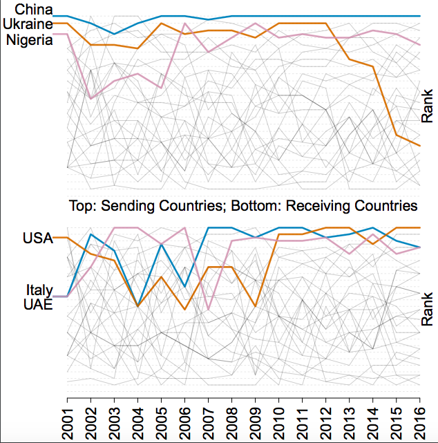

## About
This repository contains code and data from the project Reconstructing the Transnational Human Trafficking Network by Goist, Chen, and Boylan. We will publically release all of our data and code upon publication of the project. Please contact us if you would like any more information about the project or data.

### Content
`python/`: Contains code for entity extraction process and classification models.

`R/`: Contains code for estimating the ERGM model of the collapsed trafficking network.

`data/`: Contains edgelists generated from the text of reports and gazetteer used.

`plots/`: Contains figures

