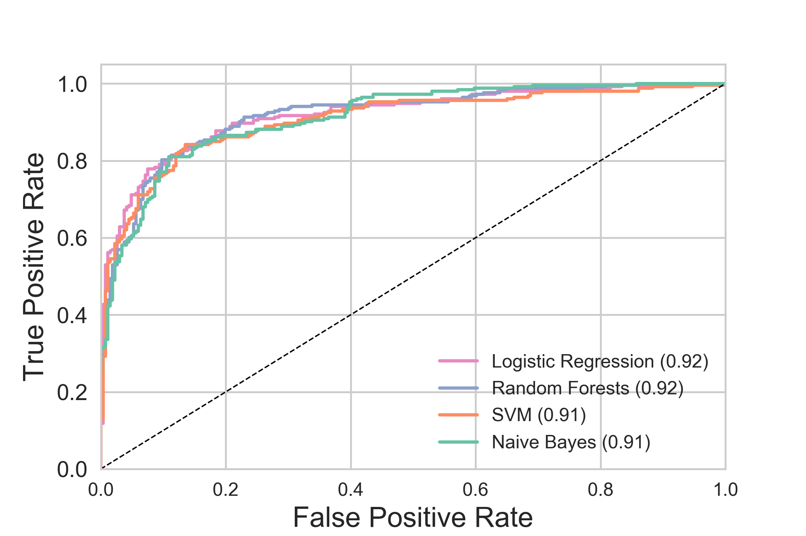
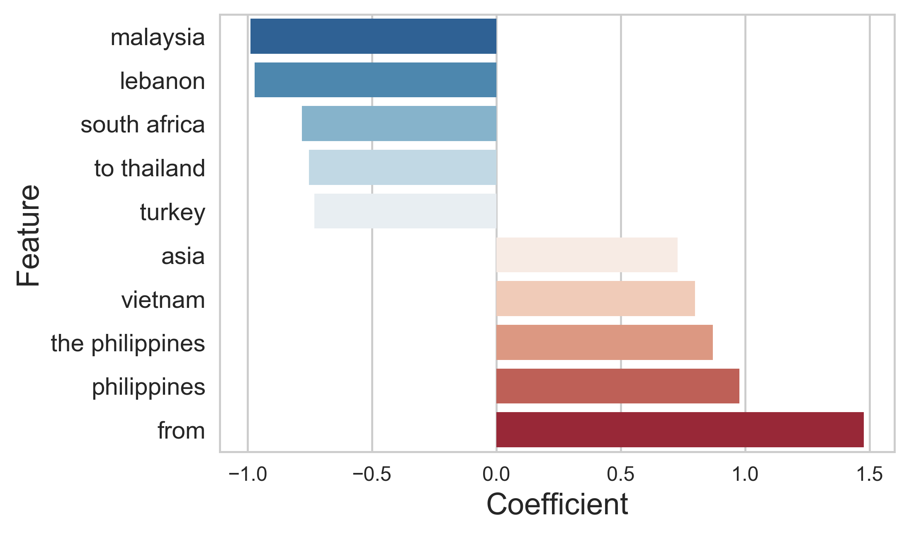

## About
This repository contains code and data from the project Reconstructing the Transnational Human Trafficking Network by Goist, Chen, and Boylan. We will publically release all of our data and code upon publication of the project.

### Content
`python/`: Contains code for entity extraction process and classification models.

`data/`: Contains edgelists generated from the text of reports.

`plots/`: Contains figures

